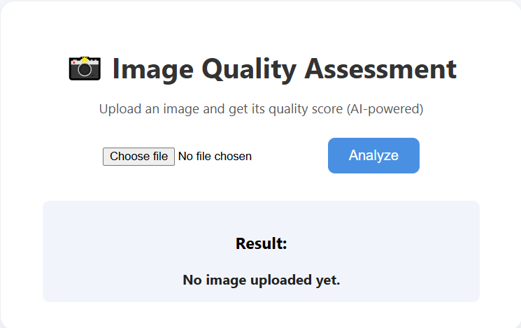

# 🖼️ Image Quality Assessment – Deep Learning Pipeline  

<p align="center">
  
</p>

<p align="center">
  <a href="https://fastapi.tiangolo.com/"></a>
  <a href="https://pytorch.org/"></a>
  <a href="https://www.docker.com/"></a>
  <a href="https://opensource.org/licenses/MIT"></a>
</p>

A full-stack project for **No-Reference Image Quality Assessment (NR-IQA)**.  
Built with **Python, PyTorch, FastAPI & Docker**, this pipeline takes raw images, runs a trained deep-learning model, and predicts a **quality score** without needing the original reference image.

---

## 📜 Table of Contents
- [About](#-about)
- [Features](#-features)
- [UI Preview](#-ui-preview)
- [Project Structure](#-project-structure)
- [Installation](#-installation)
- [Usage](#-usage)
- [Docker Deployment](#-docker-deployment)
- [Tech Stack](#-tech-stack)
- [License](#-license)

---

## 🔎 About
Real-world images often suffer from compression, blur, noise, or artifacts.  
Traditional IQA metrics (PSNR, SSIM) need a “perfect” reference image — which we rarely have.  
This project implements **deep learning NR-IQA** to:
- Predict perceptual quality from any image
- Enable automated QA in photo platforms, streaming, and dataset filtering

Dataset used: **[KonIQ-10k](http://database.mmsp-kn.de/koniq-10k-database.html)** (10,000 diverse images, 512×384 px)

---

## ✨ Features
- 🚀 **FastAPI** REST endpoint for real-time scoring
- 🧠 **PyTorch** model with configurable backbone
- 🎨 **Modern UI** for uploading images & visualizing scores
- 📦 **Docker-ready** for clean deployment
- ☁️ Render-friendly: automatic builds & deploys
- 📊 Hooks for **model retraining & logging**

---

## 🖥️ UI Preview
<p align="center">
  
</p>

The `/ui` endpoint serves a clean, user-friendly web interface for image uploads & quality scoring.

---

## 📂 Project Structure

```plaintext
Image_Quality_Assessment/
│
├── artifacts/              # Saved models (model.pth etc.)
├── data/                   # (ignored by git) dataset / images
├── src/
│   ├── model.py            # PyTorch model & loading utilities
│   ├── inference_api.py    # FastAPI app exposing `/predict` + UI
│   └── utils.py            # Preprocessing & helpers
│
├── static/                 # HTML, CSS, JS for UI
│   └── index.html
│
├── requirements.txt        # Python dependencies
├── Dockerfile              # Build instructions for Docker
├── .dockerignore           # Ignore unnecessary files for container
├── .gitignore              # Ignore venv, data, logs etc.
├── README.md               # You’re reading it
└── LICENSE
⚙️ Installation
bash
Copy code
# 1. Clone the repo
git clone https://github.com/YOUR_USER/Image_Quality_Assessment.git
cd Image_Quality_Assessment

# 2. Create & activate virtualenv (optional but clean)
python -m venv venv
source venv/bin/activate   # (Windows: venv\Scripts\activate)

# 3. Install dependencies
pip install -r requirements.txt
🚀 Usage
Run API locally
bash
Copy code
uvicorn src.inference_api:app --host 0.0.0.0 --port 8000 --reload
API Docs → http://127.0.0.1:8000/docs

UI Page → http://127.0.0.1:8000/ui

🐳 Docker Deployment
bash
Copy code
# Build Docker image
docker build -t image-quality-assessment .

# Run container
docker run -d -p 8000:8000 image-quality-assessment
Visit:

API Docs → http://localhost:8000/docs

UI Page → http://localhost:8000/ui

🛠 Tech Stack
Python 3.11

PyTorch – Deep learning framework

FastAPI – High-performance web API

Uvicorn – ASGI server

Docker – Containerization & cloud deployment

HTML/CSS – Custom UI frontend

📜 License
MIT – feel free to fork & remix.
If you use this repo, star ⭐ it and tag me — love seeing real-world uses!

Clean code, reproducible pipelines, and a Docker-first mindset — ship models like products. 🚀